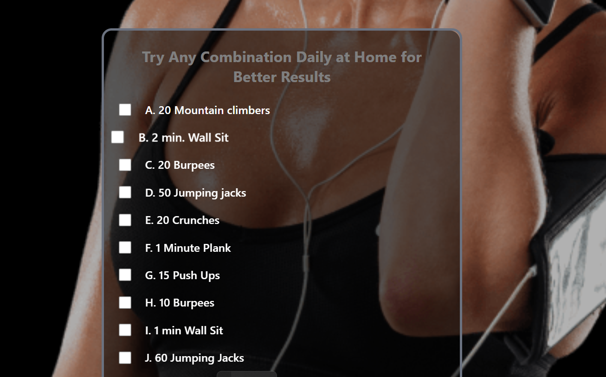

# SK Fitness Gym Website

A clean, responsive gym website designed to showcase SK Fitness services and help users explore offerings with ease. Built with simplicity and scalability in mind using HTML, Tailwind CSS, and vanilla JavaScript.

## Live Demo

- Primary: [SK Fitness](https://skfitness-theta.vercel.app/)  
- Alternate: [SK Fitness GitHub](https://mini-page.github.io/skfitness/)

  

---

## Features

- Responsive design with Tailwind CSS  
- Simple, fast-loading static site using HTML, CSS, and JS  
- Dummy payment method implemented (placeholder for future integration)  
- Client testimonial section included (fake testimonial for demo)  
- SEO-friendly structure and meta tags  
- Easy to expand tech stack in future (React, backend, payment gateways)

  

---

## Tech Stack

| Technology | Purpose               |
|------------|-----------------------|
| HTML       | Markup and structure  |
| Tailwind CSS | Styling and responsiveness |
| JavaScript | Interactive elements  |


---

## Installation & Usage

1. Clone the repo:  
   ```bash
   git clone https://github.com/mini-page/skfitness.git
   ```
2. Open `index.html` in your browser or serve with any static server.  
3. Customize as needed for your gym or client.

---

## Contribution Guidelines

Contributions are welcome! Please follow these steps:

1. Fork the repo  
2. Create a new branch (`git checkout -b feature/your-feature`)  
3. Commit your changes (`git commit -m 'Add some feature'`)  
4. Push to branch (`git push origin feature/your-feature`)  
5. Open a Pull Request describing your changes

---

## Client Testimonial

> "SK Fitness transformed my routine — the website is sleek and easy to use. Highly recommend for anyone serious about fitness!"  
> — *Trang Gupta, CLIENT*



---

## License

This project is licensed under the MIT License. See the [LICENSE](LICENSE) file for details.

---

## Contact

For questions or collaboration:  
**UG (mini-page)**  
Email: [Connect with me](raghavans5711@gmail.com)  
GitHub: [mini-page](https://github.com/mini-page)

---

*Made with ❤️ and Tailwind CSS by Umang Gupta*